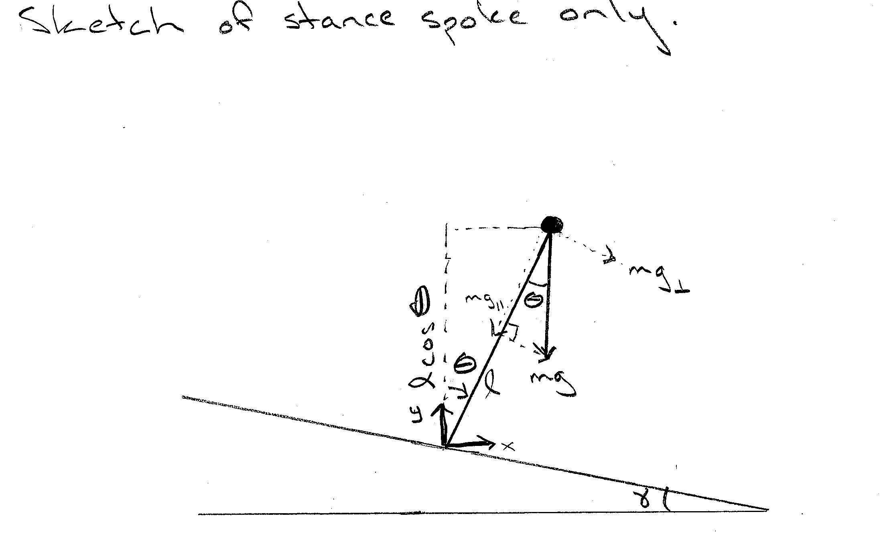
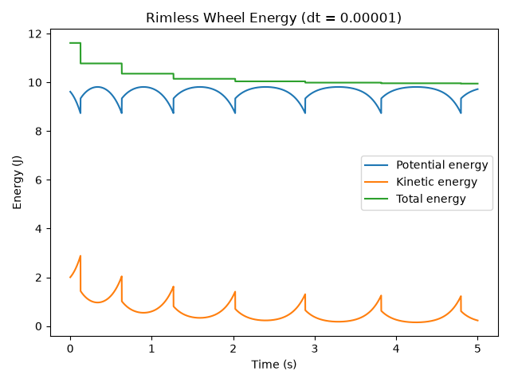
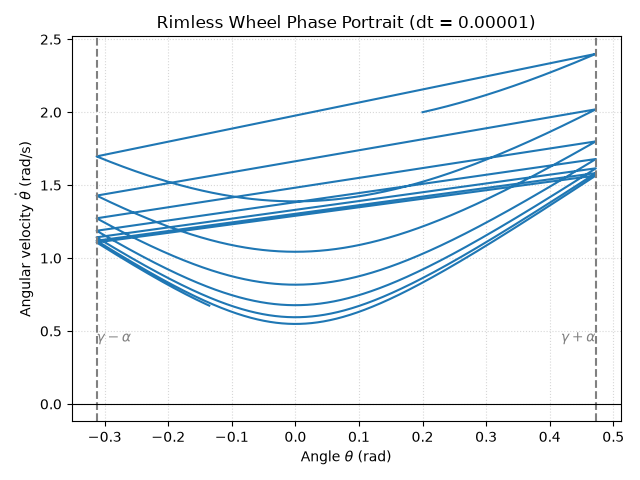
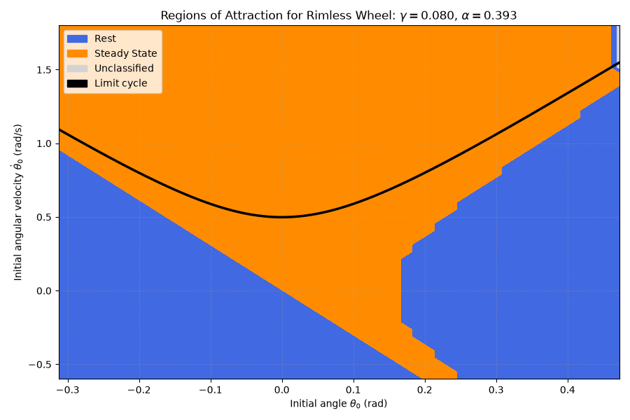
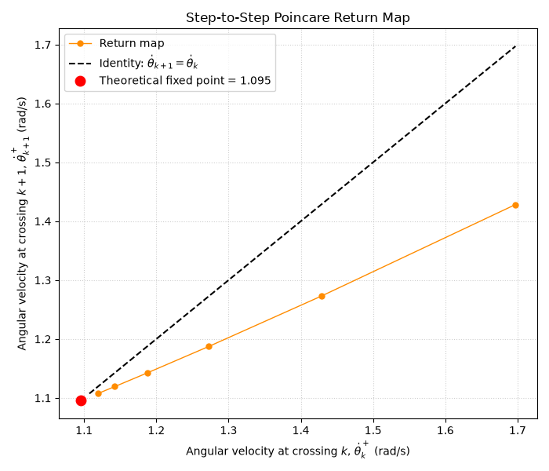
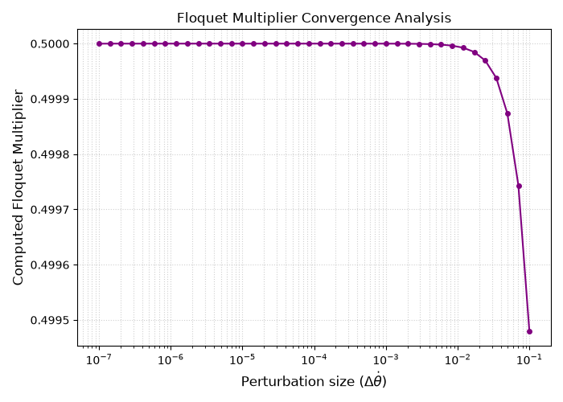
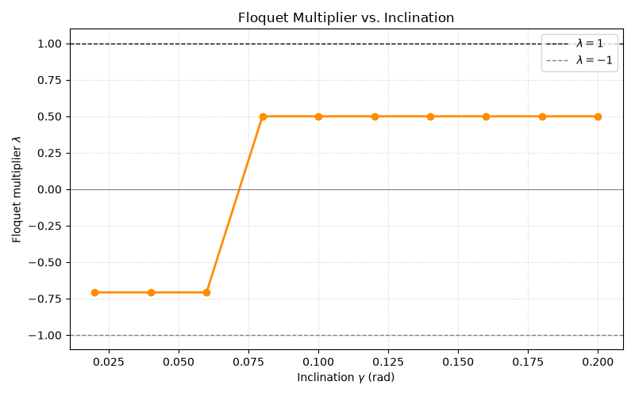
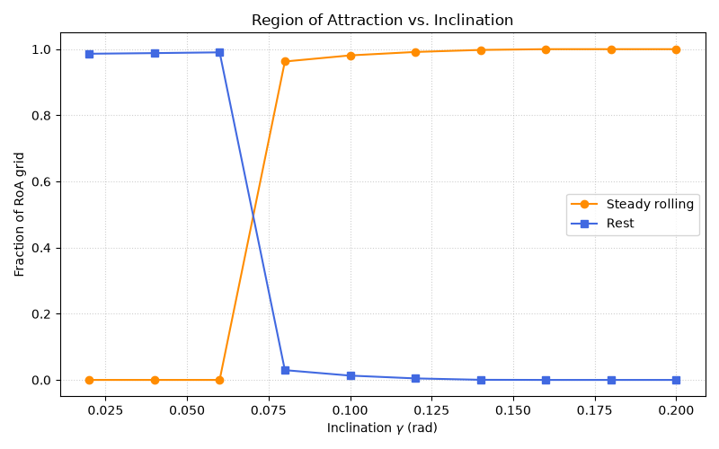
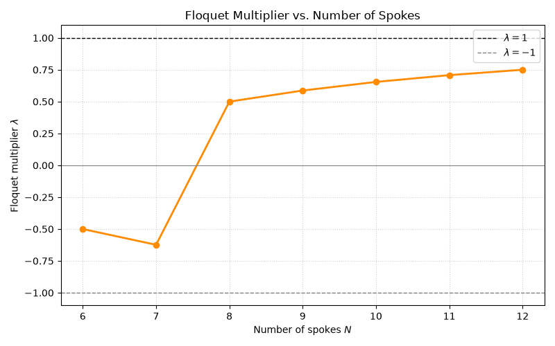
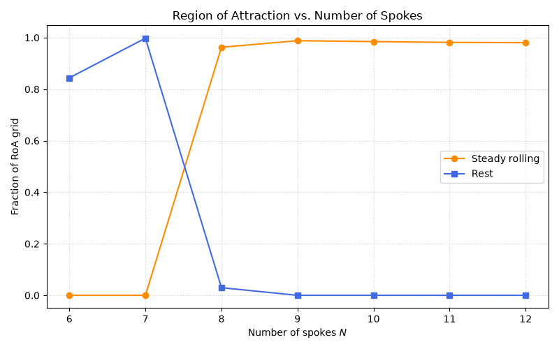

# Assignment 1

Alexis Herfurth; Net ID: ash332; 9/9/2026

## Model: the Rimless Wheel

A sketch of the rimless wheel model with parameters and states annotated is attached below.  To find the dynamics of the rimless wheel, we will first need to find its equation of motion through mechanics.  The equation of motion comes out to be $\ddot{\theta} = \frac{g}{l} \sin(\theta)$, which means the dynamics of the system are $$\dot{x} = \begin{pmatrix} \dot{\theta} \\ \ddot{\theta} \end{pmatrix} = \begin{pmatrix} \dot{\theta} \\ \frac{g}{l} \sin(\theta) \end{pmatrix}$$  Futhermore, the potential and kinetic energies of this model are $KE = \frac{1}{2} m l^2 \dot{\theta}^2$ and $PE = mgl \cos{\theta}$ (measured from the bottom of the stance spoke to the hub).  Details of the derivation, as well as two sketches, are presented below:

Dynamics of the rimless wheel:
$$\Sigma \tau = I \ddot{\theta}$$
$$\text{where } I = m l^2 \text{ is the moment of inertia of a point mass at the end of a massless rod.}$$
$$l(mg \sin(\theta)) = m l^2 \ddot{\theta}$$
$$\ddot{\theta} = \frac{g}{l} \sin(\theta)$$

Kinetic and potential energies of the rimless wheel:
$$KE = \frac{1}{2} m v^2$$
$$KE = \frac{1}{2} m l^2 \dot{\theta}^2$$
$$PE = mgl \cos{\theta}$$

As mentioned in the assignment, the rimless wheel has impact events and experiences nonsmooth jumps.  These should be modeled as an instantaneous plastic collision, where angular momentum is conserved but kinetic energy is not.  As covered in class, the new velocity should be calculated such that angular momentum about the new contact point is conserved: $\dot{\theta}^+ = \dot{\theta}^- \cos(2 \alpha)$.  During impact, $\theta = \gamma \pm \alpha$ depending on whether $\theta$ is measured from the previous or new stance spoke (also discussed in lecture).  Therefore, a detect impact function was implemented where if the rimless wheel is rolling forward (meaning if $\theta \geq \gamma + \alpha$ and $\dot{\theta} > 0$), the angular velocity is updated according to $\dot{\theta}^+ = \dot{\theta}^- \cos(2\alpha)$ and the angle is reset to $\theta = \gamma - \alpha$ to shift the coordinate system to the new stance spoke.  Similarly, if the rimless wheel is rolling backward (meaning if $\theta \leq \gamma - \alpha$ and $\dot{\theta} < 0$), the angular velocity is updated according to $\dot{\theta}^+ = \dot{\theta}^- \cos(2\alpha)$ and the angle is reset to $\theta = \gamma + \alpha$.  

Two sanity checks were done to ensure the code is working properly.  The first was to check if the total energy of the system stays constant if there is no impact.  To test this, the impact function was commented out in simulate_rimless_wheel and looking at the energy plot.  If the total energy was constant, the plot would show a straight horizontal line.  Futhermore, since the rimless wheel acts like an inverted pendulum, the kinetic and potential energy plots should be periodic--similar to the energy plots in Assignment 0.  The second was to make sure the impact function was operating the way it should by verifying that the total energy plot sharply drops during impact (while staying constant elsewhere) and that state before and after correctly conserved angular momentum.  For the latter, a conditional breakpoint was added where the impact was called in the simulation.  The before and after values were verified through hand calculations.  Both checks were executed with no issues (i.e. what happened was expected).  An energy plot and an phase portrait example where gravity = 9.81, mass = 1.0, length = 1.0, number of spokes = 8, gamma = 0.08, and timestep = 1e-5 are shown below:

## Analysis

### Region of Attraction (RoA)
A region of attraction (or RoA) is a region of the phase space, over which iterations are defined, such that any point (any initial condition) in that region will asymptotically be iterated into the attractor (according to the Wikipedia page "Attractor").  In other words, a RoA is the set of all initial states from which a system's trajectory eventually converge to a specific attractor, such as a stable equilibrium point or a limit cycle, as time goes to infinity.

For the rimless wheel, there should be two attractors.  The first occurs when the potential energy gained (measured from the bottom of the stance spoke to the hub) at impact due to transitioning between spokes equals the kinetic energy dissipated during impact.  Once this happens, the model will enter a steady state, where the rimless wheel settles into a continuous periodic rolling or "walking."  Thus, the attractor would be a stable limit cycle.  In mathematical terms, this becomes

Kinetic and potential energies:
$$KE = \frac{1}{2} m l^2 (\dot{\theta})^2$$
$$PE = m g l \cos{\theta}$$

Energy balance once in steady state: 
$$\Delta PE + \Delta KE = 0$$

Kinetic energy before impact:  
$$KE_{before} = \frac{1}{2} m l^2 (\dot{\theta}^-)^2$$

Kinetic energy after impact:
$$KE_{after} = \frac{1}{2} m l^2 (\dot{\theta}^+)^2 = \frac{1}{2} m l^2 (\dot{\theta}^-\cos{(2\alpha)})^2$$

Loss in kinetic energy:
$$-\Delta KE = -\left(\frac{1}{2} m l^2 (\dot{\theta}^-\cos{(2\alpha)})^2 - \frac{1}{2} m l^2 (\dot{\theta}^-)^2\right) = \frac{1}{2} m l^2 (\dot{\theta}^-)^2 (1 - \cos^2{(2 \alpha)}) = \frac{1}{2} m l^2 (\dot{\theta}^-)^2 \sin^2{(2 \alpha)}$$

Potential energy before impact:
$$PE_{before} = m g l \cos(\gamma + \alpha)$$

Potential energy after impact:
$$PE_{after} = m g l \cos(\gamma - \alpha)$$

Gain in potential energy:
$$\Delta PE = m g l (\cos(\gamma - \alpha) - \cos(\gamma + \alpha))$$

Solving for the steady state angular velocity:
$$\Delta PE = -\Delta KE$$
$$m g l (\cos(\gamma - \alpha) - \cos(\gamma + \alpha)) = \frac{1}{2} m l^2 (\dot{\theta}^-)^2 (\sin^2{(2 \alpha)})$$
$$\dot{\theta}^- = \sqrt{\frac{2 g (\cos(\gamma - \alpha) - \cos(\gamma + \alpha))}{l (\sin^2{(2 \alpha)})}}$$

The second attractor takes place when the rimless wheel comes to rest because its kinetic energy can no longer overcome the potential energy, casuing angular velocity to be zero.  This attractor would be an asymptotically stable equilibrium point.  To estimate the regions of attraction faster but still accurate, we will only account initial conditions where $\theta$ is between $\gamma - \alpha$ and $\gamma + \alpha$ so that we can model the wheel's behavior within a single spoke-to-spoke step.  This represents the motion of the wheel from immediately after one impact at $\theta=\gamma-\alpha$ to the subsequent impact at $\theta=\gamma+\alpha$  Since the coordinates are reset to $\gamma-\alpha$ after each impact, this interval is sufficient to characterize the wheel's behavior over successive steps.  

Furthermore, as noted in the problem description, the non-smooth impact requires requires much smaller timesteps to be precise.  Therefore, rather than simply applying the impact at the end of a timestep, the simulation first uses a single Runge-Kutta 4th order (RK4) integration step to determine whether the rimless wheel crosses an impact event guard during the timestep.  If an impact is detected, the time of the impact is refined using a bisection procedure, which involves the timestep becoming repeatedly divided into lower and upper bounds, and the dynamics are integrated to the midpoint of the interval to determine whether the impact event guard has been crossed.  After 30 bisection iterations, the midpoint of the final interval is used as the estimated impact time.  The state is then integrated up to the estimated impact time, the impact dynamics are applied to determine the post-impact state, and the dynamics are integrated for the remainder of the original timestep. Thus, the returned state corresponds to the end of the full timestep while the impact time and post-impact state are retained separately.  This approach allows a larger timestep to be used during the RoA grid search while providing a more accurate treatment of the non-smooth impact events.  The accuracy of the RoA results was checked by repeating the grid search with progressively smaller timesteps and verifying that the resulting regions of attraction did not change significantly.

A state-space plot showing the RoA of every stable attractor, including fixed points and limit cycles, is shown below.  The limit cycle is plotted as well for reference.

### Poincare Section/One-Dimensional Step-to-Step Return Map
A Poincare section is a way of turning a continuous-time dynamical system into a simpler discrete time system.  For the rimless wheel, the Poincare section will be taken at the moments immediately after each impact/contact (i.e. when the wheel's angle is reset to $\theta = \gamma - \alpha$).  By recording the angular velocity at these instances, we can construct a one-dimensional step-to-step return map that captures the evolution of the system from one impact to the next.  We can then identify fixed points corresponding to steady state behaviors and analyze their stability.  The one-dimensional step-to-step return map of the form

$$\dot{\theta}_{k+1} = P(\dot{\theta}_k)$$

where $\dot{\theta}_k$ is the angular velocity immediately after the $k$-th impact, $\dot{\theta}_{k+1}$ is the angular velocity immediately after the $(k+1)$-th impact, and $P$ is the Poincare map that describes the step-to-step evolution of the system is shown below.

### Floquet Multiplier

The Floquet multiplier is a measure of the stability of a periodic orbit in a dynamical system (according to Wikipedia under "Floquet theory").  For the rimless wheel, the Floquet multiplier can be computed from the linearization of the Poincare map around the fixed point corresponding to the steady state behavior.  In mathematical terms, if the fixed point of the Poincare map is $\dot{\theta}^*$, the Floquet multiplier $\lambda$ is given by

$$\lambda = \left.\frac{dP}{d\dot{\theta}}\right|_{\dot{\theta}=\dot{\theta}^*}$$

The Floquet multipler can also be approximated by estimating the local slope through central finite differences

$$\lambda \approx \frac{P(\dot{\theta}^* + \Delta \dot{\theta}) - P(\dot{\theta}^* - \Delta \dot{\theta})}{2 \Delta \dot{\theta}}$$

where $\Delta \dot{\theta}$ is a small perturbation to the angular velocity immediately after the impact.

If the magnitude of the Floquet multiplier is less than one (or within the unit circle), the periodic orbit is stable.  If it is greater than one (or outside the unit circle), the orbit is unstable.  For the rimless wheel, the Floquet multiplier helps assess the stability of the steady state rolling.  A plot of the computed Floquet multipliers versus perturbation size is shown below:

From the plot, we can see that the Floquet multiplier converges as the perturbation size decreases, which shows the stability of the steady state rolling for the rimless wheel.

### How the Inclination and Number of Spokes Affects the RoA and Local Convergence

The inclination of the downhill slope, $\gamma$, and the number of spokes, $N$, both can significantly affect the region of attraction (RoA) and the local convergence properties of the rimless wheel.  In the case of the inclination, when $\gamma$ is less than approximately $0.06$ rad, the Floquet multiplier is $\lambda \approx -0.7$.  As $\gamma$ increases, the Floquet multiplier becomes positive and converges to a value of $\lambda \approx 0.5$.  Since both of these values are less than one in magnitude, the steady state rolling remains locally stable.  The reason why the Floquet multiplier changes negative to positive is due to the transition from oscillatory to non-oscillatory convergence as the slope steepens.  Similarly, when $\gamma < 0.06$ rad, the region of attraction for the rimless wheel at rest accounts for almost 100% of the sampled phase space, meaning nearly all tested initial conditions will eventually lead the rimless wheel to rest.  This is because at shallow slopes, the gravitational potential energy gained per step is insufficient to overcome the kinetic energy lost during impact.  However, as the slope increases beyond $0.06$ rad, the rimless wheel achieves steady state rolling, and the region of attraction for steady state rolling begins to dominate, while the region of attraction for the wheel at rest diminishes down to zero.

For the number of spokes, $N$, the Floquet multiplier is between $-0.6 < \lambda < -0.5$ when there are six or seven spokes.  As $N$ increases to eight and beyond, the Floquet multiplier begins to converge to $\lambda \approx 0.75$.  Similar to the inclination case, since the magnitude of the Floquet multiplier remains less than one, the steady state rolling remains locally stable.  The reason why the Floquet multiplier changes negative to positive is due to the transition from oscillatory to non-oscillatory convergence as more spokes are added to the wheel.  For the regions of attraction, when $N < 7$, the region of attraction for the rimless wheel at rest accounts for almost 100% of the sampled phase space, meaning nearly all tested initial conditions will eventually lead the rimless wheel to rest.  This is because the wider spacing between the spokes results in less frequent impacts, allowing the wheel to decrease in velocity.  Thus, the energy lost per impact is greater than the gravitational potential energy gained, causing the rimless wheel to rest.  As $N$ increases beyond seven, the region of attraction for the rimless wheel at rest diminishes, and the region of attraction for the steady state rolling begins to dominate.

Four visualizations are provided below to illustrate how the inclination and the number of spokes affect the Floquet multiplier and the region of attraction for the rimless wheel.

